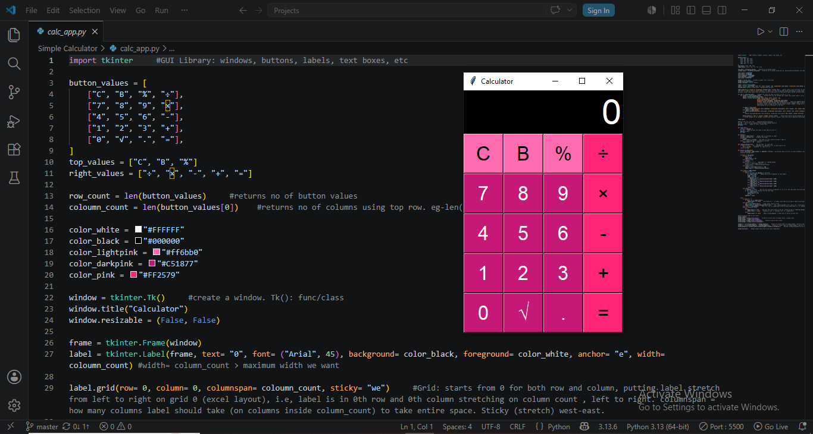

# Calculator App: 
A simple app built using Python and Tkinter.

## Features:
- Addition
- Subtraction
- Multiplication
- Division
- Percentage
- Decimal Calculations
- Clear button (C)
- Delete button (B)
- Responsive calculator interface

## Technologies Used
- Python
- Tkinter

